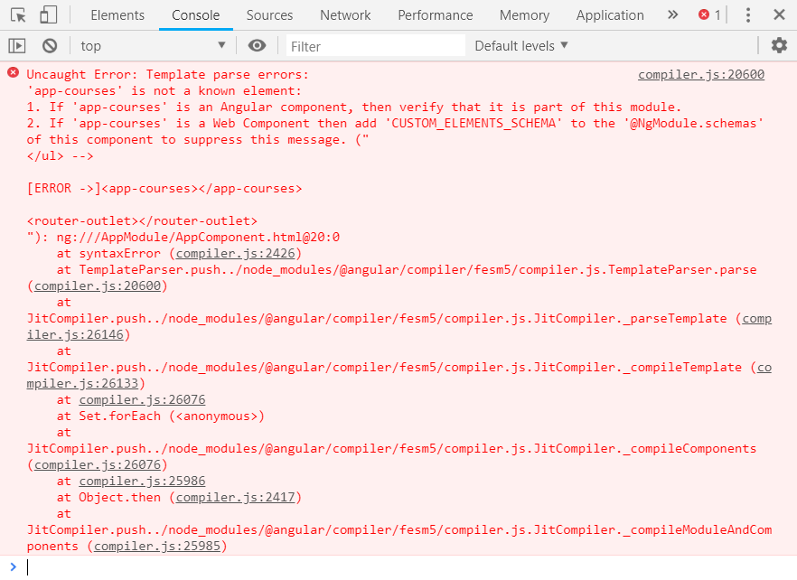
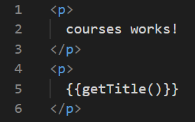

# Jobsheet 3 - Angular Fundamental 

### Praktikum – Bagian 1: Component Basic

- Buatlah sebuah componen dengan nama **courses** dengan cara ketik perintah `ng generate component name` atau ` ng g c nama`


- Buka file **app.component.html**, lakukan modifikasi code menjadi seperti berikut:

```html
<app-courses></app-courses>

<router-outlet></router-outlet>
```

- Jalankan perintah `ng serve --open`


- Buka file **app.modules.ts** dan hapus course component pada declaration, seperti berikut:


- Jalankan angular.

- Lakukan *inspect* pada halaman. Terdapat error setelag **Go to Definition** , **app-course** merupakan elemen yang tidak diketahui:




### Praktikum – Bagian 2: Templates

- Buka file **courses.component.ts** tambahkan property baru dengan nama *title*


- Tambahkan string pada binding data. Buka file **courses.component.html**. tambahkan seperti berikut:


- Kemudian refresh browser


- Buka file **courses.component.ts** dan buatlah sebuah method dengan nama *getTitle* seperti berikut ini:


- Buka file **courses.component.html**, lakukan modifikasi seperti berikut:



- Refresh dan perhatikan hasilnya


### Praktikum - Bagian 3: Directive

- Buka file **courses.component.ts** dan buat properti dengan nama *course* dengan data berupa array

```typescript
import { Component, OnInit } from '@angular/core';
import { CoursesService } from '../courses.service';

@Component({
  selector: 'app-courses',
  templateUrl: './courses.component.html',
  styleUrls: ['./courses.component.css']
})
export class CoursesComponent implements OnInit {

  title = 'Belajar Angular';
  Courses = [
    {id: 0, name:'HTML'},
    {id: 1, name:'PHP'},
    {id: 2, name:'ANGULAR'},
    {id: 3, name:'C#'},
    {id: 4, name:'VB.NET'},
  ]
  getTitle(){
    return this.title;
  }
  
  constructor() { }

  ngOnInit() {
  }
}
```
- Buka file **courses.component.html** tambahkan directive ngFor dan string interpolation seperti berikut:


- Refresh dan perhatikan hasilnya


### Praktikum – Bagian 4: Services dan Dependency Injection

- Buatlah service baru yang bernama *courses* dengan perintah : `ng generate service` courses atau `ng g s courses`

- Hasilnya seperti berikut:


- Buka file **courses.service.ts** kemudian tambahkan method *getCourse* seperti berikut:


- Kemudian memodifikasi file courses.component.ts seperti berikut:
import { Component, OnInit } from '@angular/core';

```typescript
@Component({
  selector: 'app-courses',
  templateUrl: './courses.component.html',
  styleUrls: ['./courses.component.css']
})
export class CoursesComponent implements OnInit {

  title = 'Belajar Angular';
  Title() {
    return this.title;
  }
  Courses;

  constructor() { }

  ngOnInit() {
  }

}
```

- Buka file **courses.component.ts**, kemudikan lakukan modifikasi codenya seperti berikut:

* Hasilnya seperti berikut:


* Tambahkan constructor pada file **courses.component.ts** seperti berikut:

```typescript
import { Component, OnInit } from '@angular/core';
import { CoursesService } from '../courses.service';

@Component({
  selector: 'app-courses',
  templateUrl: './courses.component.html',
  styleUrls: ['./courses.component.css']
})
export class CoursesComponent implements OnInit {

  title = 'Belajar Angular';
  Courses;

  constructor(private service:CoursesService) {
    this.Courses=service.getCourses();
  }

  ngOnInit() {
  }
}
```
- Hasilnya seperti berikut:


